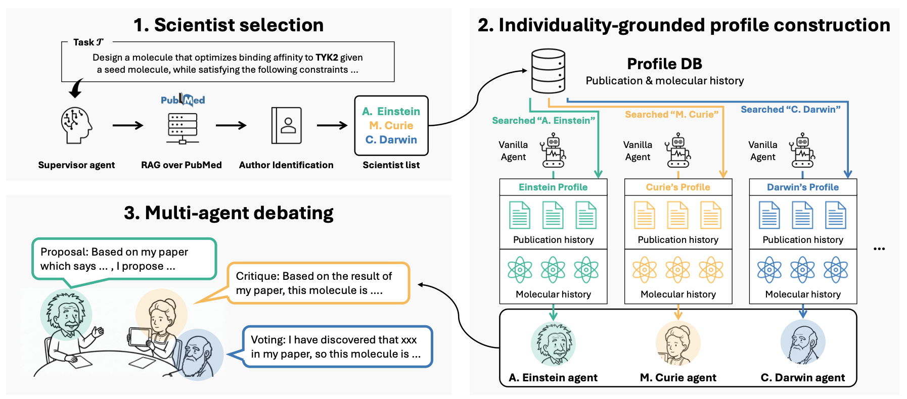

# INDIBATOR

This is the official code repository for the paper titled [INDIBATOR: Diverse and Fact-Grounded Individuality for Multi-Agent Debate in Molecular Discovery](https://arxiv.org/abs/2602.01815).

<p align="center">
    
</p>

## Contribution
+ We introduce a method to ensure the individuality of collaborative agents by grounding them in specific expertise profiles.
+ We propose INDIBATOR, a multi-agent framework that utilizes research trajectories for scientific discovery, which gurantees diverse and fact-grounding agents.
+ We provide qualitative and quantitative analyses demonstrating the impact of individuality on agent reasoning and performance.
+ We validate INDIBATOR in the domain of molecular discovery, demonstrating consistent improvements across multiple downstream tasks.

## Overview

The system orchestrates a multi-round debate between scientist agents, each with expertise derived from real PubMed publications and associated molecular structures. The workflow:

1. **Supervisor** selects relevant scientists via RAG over a PubMed database
2. **Scientist agents** propose, critique, and vote on molecular candidates across multiple debate rounds
3. **Reviewer** scores and validates the generated molecules

## Installation

### 1. Install dependencies

```bash
uv sync
```

### 2. Set up dataset

The system requires a running [pubmedFastRAG](https://github.com/domluna/pubmedFastRAG) service for scientist retrieval. You need to run this in a separate terminal.:

```bash
cd pubmedFastRAG
bash start_servers.sh
```

### 3. Environment variables

You can choose any model that you want. Create a `.env` file in the project root with your API keys:

```
OPENAI_API_KEY=...
DEEPSEEK_API_KEY=...
ANTHROPIC_API_KEY=...
GOOGLE_API_KEY=...
```


### 4. Construct database

Create a project and get a project id and dataset name in [ChemBL dataset](https://console.cloud.google.com/projectselector2/bigquery?p=patents-public-data&d=patents&page=dataset&supportedpurview=project).

Download molecular data and convert author names in pubmed database with:
```
uv run construct_dataset.py
```


## Usage

### Boltz Binding Affinity

Generate molecules optimized for binding affinity predicted by Boltz:

```bash
bash bash/boltz/TYK2.sh
```

### Practical Molecular Optimization (PMO)

Optimize molecules for a target oracle (e.g., GSK3B bioactivity):

```bash
bash bash/pmo/GSK3B/run.sh
```

### Lead Optimization

Optimize a seed molecule for a target while satisfying QED, SA, and similarity constraints:

```bash
bash bash/lead_optimization/5ht1b/5ht1b_deepseek.sh
```


### Custom run

```bash
uv run python -m src.agent.main \
    --task_name pmo/GSK3B \
    --model deepseek-chat \
    --scientists 50 \
    --rounds 20 \
    --num_candidates 1000 \
    --num_mols_per_scientist 30 \
    --is_rag_keyword \
    --wandb_mode online
```

### Key arguments

| Argument | Description | Default |
|---|---|---|
| `--task_name` | Task identifier (e.g., `pmo/GSK3B`, `lead_optimization/5ht1b`) | `lead_optimization/parp1` |
| `--model` | LLM model name | `gpt-4o-mini` |
| `--scientists` | Number of scientist agents | `3` |
| `--rounds` | Maximum debate rounds | `3` |
| `--num_candidates` | Target number of candidate molecules | `1000` |
| `--num_mols_per_scientist` | Molecules proposed per scientist per round | `3` |
| `--is_self_critique_on` | Enable self-critique phase | off (this should not be turned on on the tasks that constrains the number of oracle calls such as PMO) |
| `--seed_mol_index` | Seed molecule index (lead optimization) | `1` |
| `--sim_threshold` | Similarity threshold (lead optimization) | `0.4` |
| `--wandb_mode` | Weights & Biases logging mode (`online`, `offline`, `disabled`) | `disabled` |


## Citation

If you find our paper and this repo useful, we kindly ask to cite our paper:

```BibTex
@misc{jang2026indibatordiversefactgroundedindividuality,
      title={INDIBATOR: Diverse and Fact-Grounded Individuality for Multi-Agent Debate in Molecular Discovery}, 
      author={Yunhui Jang and Seonghyun Park and Jaehyung Kim and Sungsoo Ahn},
      year={2026},
      eprint={2602.01815},
      archivePrefix={arXiv},
      primaryClass={cs.AI},
      url={https://arxiv.org/abs/2602.01815}, 
}
```